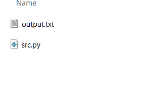
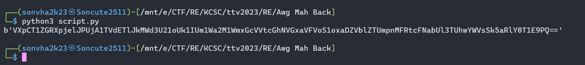
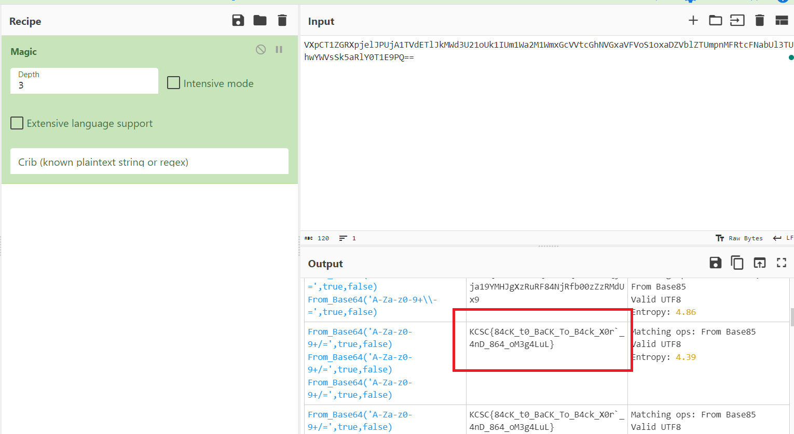

## KCSC/RE

## Awg Mah Back

### Lời giải

- Ở challenge này, ta được cung cấp 2 thứ là 1 file nhị phân `output.txt` và source python `src.py`.
  
- Đọc file python, ta kết luận được rằng file `output.txt` chính là kết quả đầu ra của chương trình, được gen ra sau các câu lệnh mã hóa từ 1 file được gọi ra tên `flag.txt`. Không thấy sự xuất hiện của file `flag.txt`, vậy nhiệm vụ của mình ở chall này sẽ là giải mã file `output.txt` từ source cho trước để lấy flag.

```python
from pwn import *

with open('flag.txt', 'rb') as (f):
    flag = f.read()
a = flag[0:len(flag) // 3]
b = flag[len(flag) // 3:2 * len(flag) // 3]
c = flag[2 * len(flag) // 3:]
a = xor(a, int(str(len(flag))[0]) + int(str(len(flag))[1]))
b = xor(a, b)
c = xor(b, c)
a = xor(c, a)
b = xor(a, b)
c = xor(b, c)
c = xor(c, int(str(len(flag))[0]) * int(str(len(flag))[1]))
enc = a + b + c
with open('output.txt', 'wb') as (f):
    f.write(enc)
```

- Trên đây là source python mình được cung cấp, tóm tắt nội dung chương trình mã hóa, mình có thể chỉ ra các công đoạn như sau:

1. Đọc nội dung từ file `flag.txt`, tách thành 3 phần tương ứng 3 chuỗi a, b, c.
2. Thực hiện các phép `xor` để mã hóa, những thành phần tham gia vào quá trình `xor` gồm 3 chuỗi a, b, c cùng với 2 phép toán `int(str(len(flag))[0]) + int(str(len(flag))[1])` và `int(str(len(flag))[0]) * int(str(len(flag))[1])`.
3. Ghép 3 chuỗi a, b, c sau khi mã hóa lại theo thứ tự ban đầu rồi viết vào file `output.txt`, xuất file dạng nhị phân.

- Để giải mã bài toán này, ta có một kiến thức về phép `xor`

```txt
Nếu a = b ^ c
Thì b = c ^ a
Các bạn có thể thử nghiệm điều này bằng cách viết một câu script nhỏ ^^.
Bản thân phép xor giữa 2 giá trị có tính hoán vị, tức là kết quả của phép a^b và b^a là như nhau, nên (a^b)^c = a^(c^b). Vậy nên từ output có sẵn, ta hoàn tòan có thể thực hiện ngược lại để lấy được đầu vào bị giấu đi.
```

- Ta thấy phần mã hóa của bài toán hoàn toàn là các phép `xor`, nên việc dịch ngược chỉ là đảo lại nội dung, đặt file input là `output.txt` đầu ra là `flag.txt`.

```python
from pwn import *

with open('output.txt', 'rb') as (f):
    flag = f.read()

a = flag[0:len(flag) // 3]
b = flag[len(flag) // 3:2 * len(flag) // 3]
c = flag[2 * len(flag) // 3:]

c = xor(c, int(str(len(flag))[0]) * int(str(len(flag))[1]))
c = xor(b, c)
b = xor(a, b)
a = xor(c, a)
c = xor(b, c)
b = xor(a, b)
a = xor(a, int(str(len(flag))[0]) + int(str(len(flag))[1]))

enc = a + b + c
print(a + b + c)
```

- Chạy script, thu được nội dung

  

- trông đây là chuỗi được mã hóa dạng base64, giải mã ra ta có flag.

  

```
flag: KCSC{84cK_t0_BaCK_To_B4ck_X0r`_4nD_864_oM3g4LuL}
```

## Mong WRITEUP này giúp ích cho các bạn!

```
from KMA
Author: 13r_ə_Rɪst
Email: sonvha2k23@cvp.vn
```
