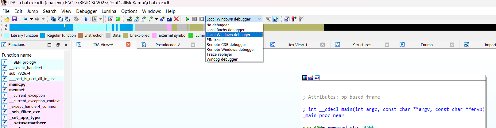
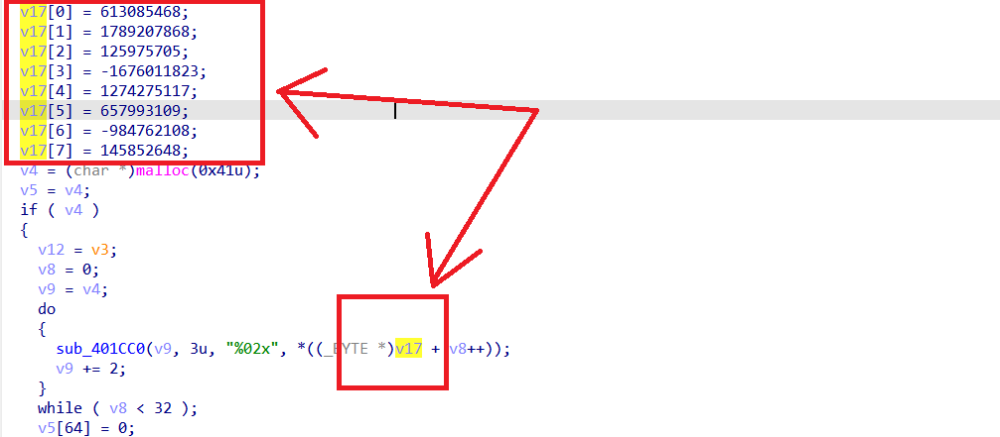
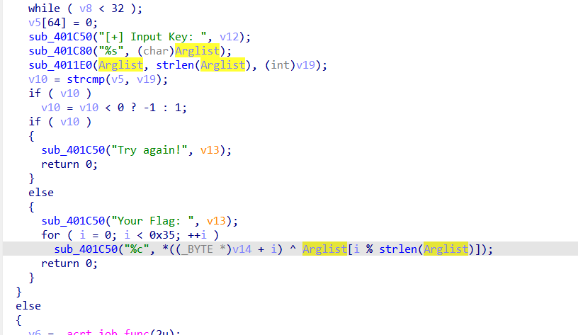
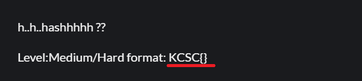
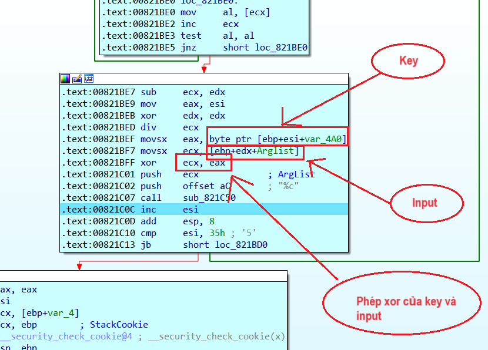
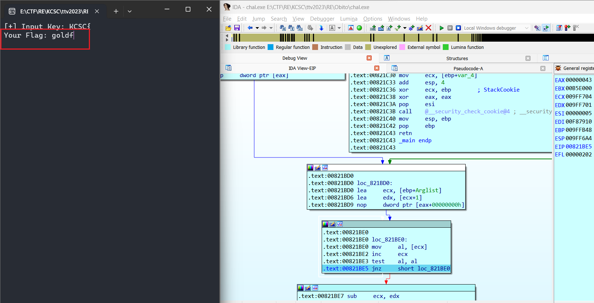
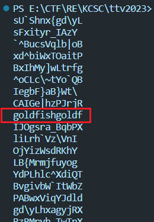
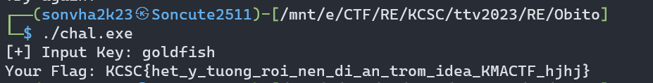

## KCSC/RE

## Dont Call Me Kamui

### Lời giải

- Ở chall này, đối với các newbie debugger(như mình), cần biết cách sử dụng chức năng debugger của `IDA`.

  

- Chọn `Local win debugger`, `f9` để thực hiện debug, `f8` để nhảy tiếp, `f7` để nhảy vào dòng lệnh hiện tại. `f7` và `f8` có chức năng giống với `step` và `ni` nếu các bạn quen thực hiện debug ở `gdb` hơn. Bấm vào dòng lệnh ở khung chương trình graphview đặt breakpoint bằng `f2`.

- Load chương trình vào `ida`, thứ đầu tiên mình chú ý tới là có mảng được khai báo với 8 giá trị. Sau đó dùng trong hàm nào đấy với các phép biến đổi và được thực hiện trước việc nhập input nên khả năng cao đây là key.

  

- Điều tiếp theo là sau khi kiểm tra độ dài, ta có hàm gen flag được thực hiện bởi một phép `xor`. Một trong hai thành phần của phép `xor` chính là input của mình. Điều đó làm mình liên tưởng tới bài `AwgMahBack`, rằng `a ^ b = c` -> `a ^ c = b`.

  

- Với flag, ta có thông tin là flag luôn có format là KCSC{}, tức là ta có thể suy ngược ra 5 kí tự đầu của input chuẩn ở kết quả của phép `xor` trên. Thực hiện chạy chương trình thông qua debbuger của `IDA` với input là `KCSC{`. Có một lệnh kiểm tra duy nhất ta cần bypass là checklen.

  

- Trong quá trình debug mình thấy key còn lại được load vào để thực hiện `xor` cùng input khá rõ ràng khả năng được sinh từ mảng gồm 8 giá trị trên. Vì vòng lặp chạy 0x35 ~ 53 lần, mình lấy 53 giá trị từ vị trí của địa chỉ này dẫn đến để viết script nếu cần.

  

- Sau 5 vòng lặp đầu, Input chuẩn được tiết lộ gồm 5 kí tự đầu là `goldf` mình sẽ dùng nó làm input để gen ngược lại các thành phần của flag do phép toán gen flag là `flag[i] = key[i] ^ input[i%input.length()]` nên mỗi khi lặp input.length() lần, ta sẽ thu được thành phần đúng gồm 5 kí tự của flag.

  

- Viết script để sinh ngược lại flag.

```python
key = [0x2C, 0x2C, 0x3F, 0x27, 0x1D, 0x01, 0x16, 0x1C, 0x38, 0x16, 0x33, 0x10, 0x13, 0x06, 0x1D, 0x0F, 0x38, 0x1D, 0x03, 0x0D, 0x39, 0x07, 0x16, 0x06, 0x38, 0x0B,
     0x05, 0x3B, 0x07, 0x07, 0x2C, 0x1C, 0x15, 0x00, 0x01, 0x3B, 0x0F, 0x0D, 0x16, 0x09, 0x38, 0x24, 0x21, 0x25, 0x25, 0x3D, 0x35, 0x37, 0x0F, 0x05, 0x04, 0x0E, 0x1B]
input = "goldf"
for j in range(53):
    comp = ""
    for i in range(5):
        comp += chr(key[(i+j) % 53] ^ ord(input[i]))
        # comp += " "
    print(comp)

```

- Output của script là tất cả các trường hợp khi xor input với key, mình nhặt ra các cụm có nghĩa.

```
KCSC{
_y_tu
_roi_
_di_a
rom_i
_KMAC
hjhj}
```

- Khi xem output, những mẩu flag trên đều cách nhau 8 lần, điều đó chỉ ra rằng Input gồm 8 kí tự. Chỉnh lại script một chút rồi chạy, ta thấy được vị trí đúng của các mẩu flag.

```python
for j in range(53):
    if j % 8 < 5:
        comp += chr(a[j] ^ ord(input[j % 8]))
    else:
        comp += "#"
print(comp)
```

- Nhận được output:

```
output: KCSC{###_y_tu###_roi_###_di_a###rom_i###_KMAC###hjhj}
```

- Từ những vị trí khuyết của flag, mình cũng có thể đoán được đáp án là gì, để cho chắc mình nhặt một phần của flag là `_y_tu###_roi_` ra, điền vào phần khuyết, cụm từ duy nhất có nghĩa là `_y_tuong_roi_`, đưa vào script đầu tiên thế chỗ cho cụm `goldf` với ý tưởng nhặt ra được input bởi cụm này dài hơn 8 ký tự, hoàn toàn đủ cơ sở làm điều đó(thực ra mình đoán được input là goldfish từ đầu rồi nma trình bày phải thuyết phục chút 🐧).

- Chạy chương trình, ta thu được các trường hợp, với thông tin ở trên rằng input có 5 kí tự đầu là `goldf` và có chiều dài là 8, dò trong output ta thấy cụm từ thoả mãn cả hai điều trên.

  

- Chạy chương trình với Input là `goldfish` và thu về flag:

  

```
flag: KCSC{het_y_tuong_roi_nen_di_an_trom_idea_KMACTF_hjhj}
```

## Mong WRITEUP này giúp ích cho các bạn!

```
from KMA
Author: 13r_ə_Rɪst
Email: sonvha2k23@cvp.vn
```
