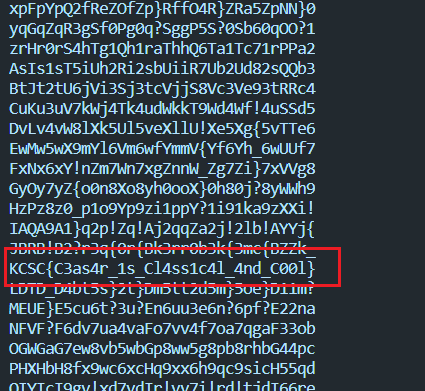

## KCSC/CRypto

## EZ_Ceasar

### Lời giải

- Viết lại chương trình để vét cạn

```python
import string
import random

alphabet = string.ascii_letters + string.digits + "!{_}?"

flag = 'ldtdMdEQ8F7NC8Nd1F88CSF1NF3TNdBB1O'
assert all(i in alphabet for i in flag)

key = random.randint(0, 2**256)


for c in range(1000):
    ct = ""
    for i in flag:
        ct += (alphabet[(alphabet.index(i) + c) % len(alphabet)])

    print(ct)

# ct='ldtdMdEQ8F7NC8Nd1F88CSF1NF3TNdBB1O'
```



```
flag: KCSC{C3as4r_1s_Cl4ss1c4l_4nd_C00l}
```

## Mong WRITEUP này giúp ích cho các bạn!

```
from KMA
Author: 13r_ə_Rɪst
Email: sonvha2k23@cvp.vn
```
