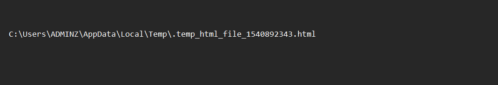
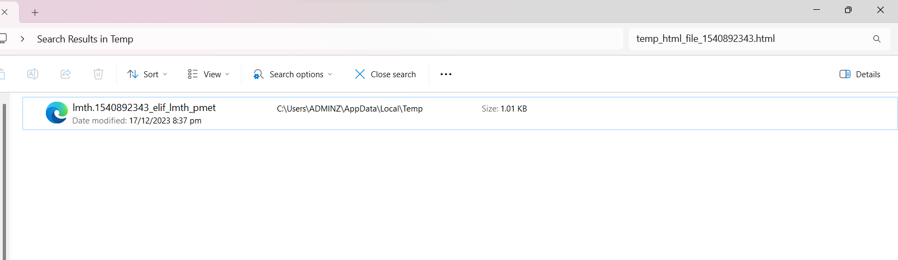
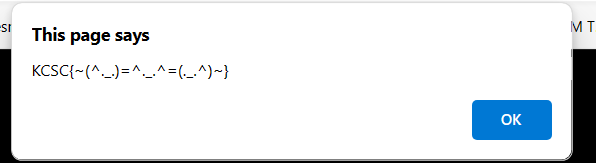
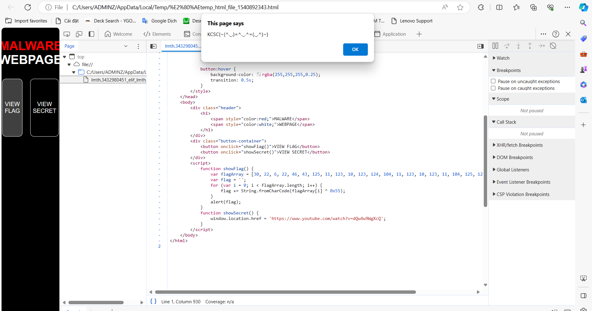

## KCSC/RE

## Hide and seek

### Lời giải

- Challenge này không có nhiều thứ để viết, chạy file thực thi, ta thấy giao diện như sau:

  

- Dù phần folowing location được che đi, ta vẫn có thể bôi đen và copy được(?).

  

- Paste ra mình thấy đường dẫn ở trong máy, search và tìm đến tên file:

  

- Chạy file `.html`. Nội dung trang gồm 2 ô, mình bấm thử vào ô flag, một alert hiện ra.

  

- Cho rằng bài không thể đơn giản như vậy, mình `f12` để đề phòng `alert` đó là fake flag. Nhưng thấy hàm gen flag khá legit đồng thời không còn thông tin gì khác(em biết thừa link kia là rickroll nên không bấm vào đâu 🐧), submit và **solved**.

  

```
flag: KCSC{~(^._.)=^._.^=(._.^)~}
```

## Mong WRITEUP này giúp ích cho các bạn!

```
from KMA
Author: 13r_ə_Rɪst
Email: sonvha2k23@cvp.vn
```
