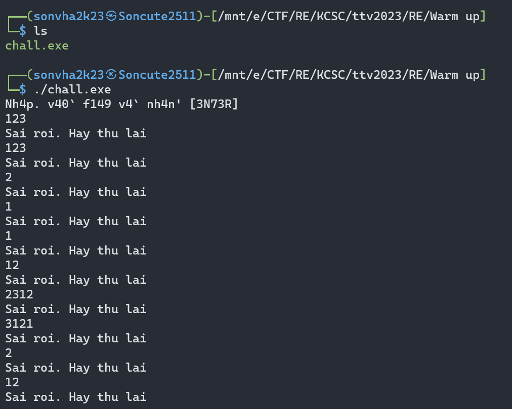

## KCSC/RE

## Images

### Lời giải

- Ở chall này ta được cấp 1 folder ảnh, hoàn toàn là chương trình `asm`. Dù dài, chương trình vô cùng đơn giản với hoàn toàn là các phép so sánh.



- Nếu có điều gì cần lưu ý ở đây, có lẽ là ở một số câu lệnh sẽ được so sánh bằng số hệ 10 hoặc 16, cần cẩn thận để tránh sai sót.

- Đọc và viết lại từ đầu tới cuối, ta thu được flag.

```
flag: KCSC{Cam_on_vi_da_kien_nhan_nhin_het_dong_anh_nay`}
```

## Mong WRITEUP này giúp ích cho các bạn!

```
from KMA
Author: 13r_ə_Rɪst
Email: sonvha2k23@cvp.vn
```
