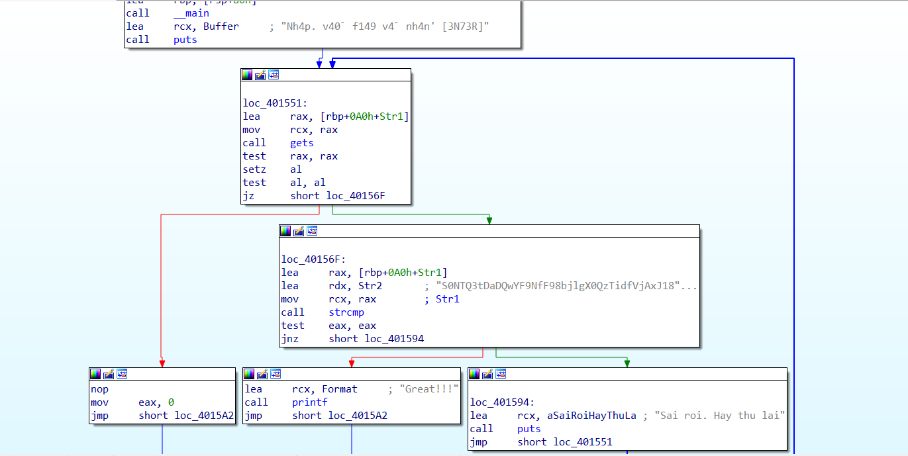
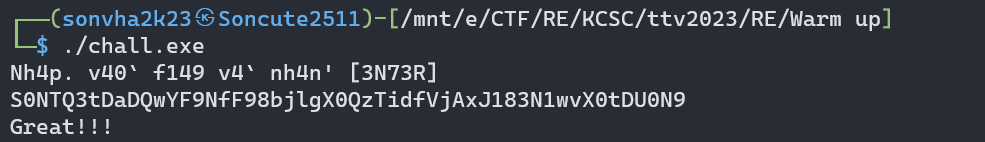
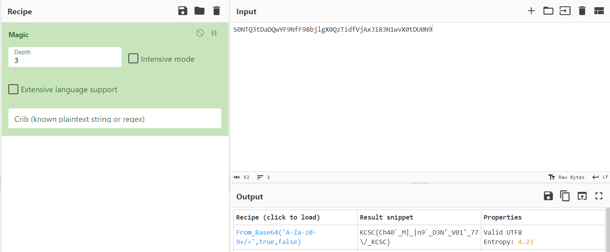

## KCSC/RE

## Warm up

### Lời giải

- Dù là bài dễ, đây lại là chall khiến mình choke cực mạnh và submit sai liên tục @@.

  

- Load vào `ida`, ta thấy lệnh `cmp` của giá trị đầu vào với chuỗi `S0NTQ3tDaDQwYF9NfF98bjlgX0QzTidfVjAxJ183N1wvX0tDU0N9`.

  

- Chạy lại chương trình với input là chuỗi ở trên để confirm.

  

- Tới đây mình lại mắc sai lầm rằng nghĩ đó là flag mà submit chứ không decrypt. Tất nhiên là sai, nhưng thứ tiếp theo mình chú ý tới lại là thông báo đầu vào khi chạy chương trình vì không dịch được ra `f149` ~ flag và 3N73R ~ `enter` mà cho rằng f149 là 1 dạng mã hóa nào đó còn `3N73R` là key hoặc ngược lại :)).

- Sau khi bất lực tìm kiếm. Mình quăng vào cyberchef với hi vọng mong manh.



- Thu được cái flag bài warmup mà cảm xúc TxT. Bài mã hóa xor mình cũng gặp vấn đề tương tự khi giải được nhưng không rõ cách decrypt output mà mò mẫm lung tung, gần hết chiều mới solve được.

## Mong WRITEUP này giúp ích cho các bạn!

```
from KMA
Author: 13r_ə_Rɪst
Email: sonvha2k23@cvp.vn
```
